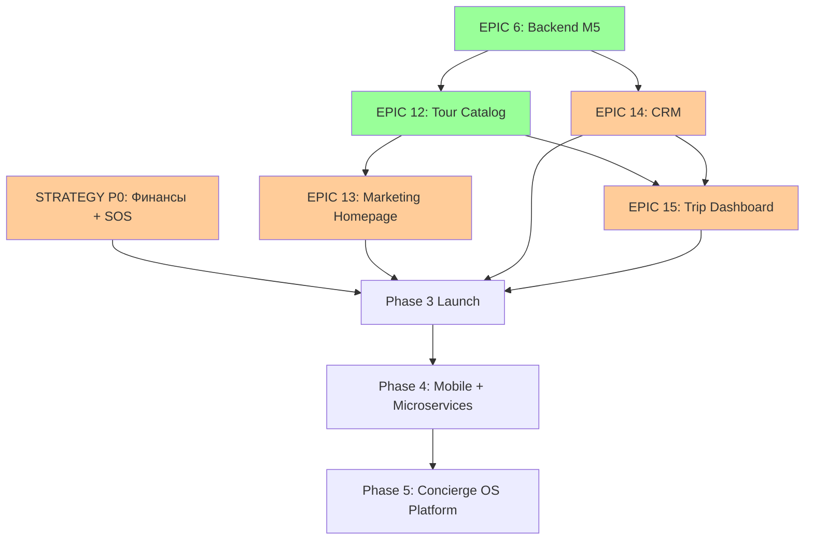

# Роадмап IndiaHorizone

> **Источник правды:** GitHub Project (https://github.com/users/Rivega42/projects/3) + Milestones + детальный план в [`docs/TZ/MVP_PHASE3.md`](docs/TZ/MVP_PHASE3.md).
> **Этот файл** — высокоуровневая карта фаз и эпиков. Подробности (acceptance criteria, sub-issues) — в Project / эпиках в Issues.

## Видение

Tech-enabled India concierge для русскоязычных клиентов. Мы продаём не туры — мы продаём **уверенность путешествовать в Индии без хаоса**. Технология ускоряет sales и сервис, локальная сеть в Индии (Shivam + concierge) даёт реальную опору на месте, AI-ассистент помогает 24/7 на русском.

Подробно: [`docs/TZ/MVP_PHASE3.md § Контекст фазы 3`](docs/TZ/MVP_PHASE3.md), [`CLAUDE.md § О проекте`](CLAUDE.md).

---

## Фазы развития

### ✅ Phase 1 — Manual ops (2025)
Кастомные туры через ручные процессы (WhatsApp + Notion + Google Docs). Платящие клиенты есть, ТЗ написано.

### 🔄 Phase 2 — Automation (Q4 2025 — Q1 2026)
**Цель:** вывести критичные процессы в код. Status: завершена (см. CHANGELOG 2026-04-25..29).

### 🔄 Phase 3 — MVP launch (Q2 2026, **сейчас**)
**Цель:** запуск с реальными платящими клиентами через Tour Catalog + Trip Dashboard.

#### Текущий квартал — что осталось

| Эпик | Что | Owner | Issue |
|---|---|---|---|
| **EPIC 6** Архитектура M5 | Backend M5 (auth/clients/trips/comm/feedback/audit/push) | Claude Code | #57 (95% done) |
| **EPIC 12** Tour Catalog | Landing pages + index + SEO + legal | Claude Code | #293 (done) |
| **EPIC 13** Marketing Homepage | Полная маркетинговая `/` через Claude Design прототип | TBD | (предстоит) |
| **EPIC 14** CRM | Менеджерский кабинет (lead → quote → trip) | TBD | (предстоит) |
| **EPIC 15** Trip Dashboard | Клиентский кабинет: программа, документы, чат, SOS | TBD | (предстоит) |
| **STRATEGY P0** Финансы + SOS | Buffer + резервный канал + concierge найм + playbooks | Roman + Shivam | #284 |

#### Блокеры production-launch'а

См. `STATE.md § Заблокировано` — VAPID keys, S3 (Beget), email creds, юр.review, ИНН/ОГРН, PROJECT_TOKEN.

### 📋 Phase 4 — Scale + Mobile (Q3-Q4 2026)
- Native mobile (React Native / Expo): trip dashboard + guide app
- Microservices extraction (auth-svc + comm-svc первыми)
- Native push (FCM v1 + APNs)
- Admin Panel (#311) — UI для каталога без re-deploy
- Дополнительные платёжные шлюзы (ЮKassa #275)
- E2E тесты (Playwright #137)

### 📋 Phase 5 — Concierge OS for partners (2027+)
Видение: продаём SOS-as-a-Service и Trip Dashboard SaaS другим india-операторам. Требует: SOS не на одном человеке, кружки накоплены (50+), онлайн-платежи работают.

---

## Эпики и зависимости (Mermaid)

---

## Метрики успеха фазы 3 → фазы 4

(Согласовать с founders. Сейчас draft. См. `docs/TZ/MVP_PHASE3.md § Метрики успеха`.)

| Метрика | Сейчас | Цель Q3 2026 |
|---|---|---|
| Платящие клиенты в квартал | <TODO> | ≥ 12 |
| % клиентов с ≥ 1 видео-фидбэком | 0 (нет фичи) | ≥ 60% |
| % клиентов, оставивших публичный отзыв | <TODO> | ≥ 40% |
| % реферальных сделок | <TODO> | ≥ 25% |
| Среднее время ответа concierge | <TODO> | ≤ 5 мин (день) / ≤ 15 мин (ночь) |
| Время реакции на SOS | <TODO> | ≤ 60 сек (день) / ≤ 3 мин (ночь) |
| NPS поездки | <TODO> | ≥ 70 |

---

## Связанные документы

- `docs/TZ/MVP_PHASE3.md` — детальный план phase 3 (источник правды для backend slice'ов)
- `docs/TZ/README.md` — индекс ТЗ (карта зависимостей между документами)
- `docs/STRATEGY/DEVELOPMENT_PLAN.md` — стратегические блоки P5 / SOS / CIRCLES
- `docs/ARCH/MICROSERVICES.md` — архитектура целевого state
- `STATE.md` — текущее состояние (live, актуализуется после каждой сессии)
- `BACKLOG.md` — текущий бэклог
- `DECISIONS.md` — архитектурные ADR
- `CHANGELOG.md` — история изменений
