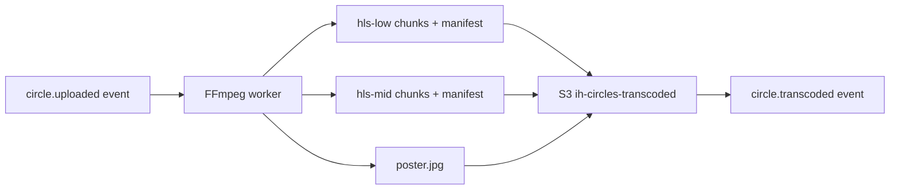

# Кружок: воспроизведение и обработка

> Закрывает [#67](https://github.com/Rivega42/indiahorizone/issues/67). Часть EPIC 6 [#57](https://github.com/Rivega42/indiahorizone/issues/57).
> Статус: Draft v0.1.

## Транскодирование

После события `circle.uploaded` → `media-svc` запускает транскодирование (FFmpeg в worker pod / serverless):

### Варианты

| Вариант | Цель | Параметры |
|---|---|---|
| `original` | Архив | Без изменения, только validation |
| `hls-low` | Слабый интернет / preview | 240p, 250 кбит/с |
| `hls-mid` | Стандарт | 480p, 600 кбит/с |
| `poster` | Превью / thumbnail | JPG 480×480 (квадратный) из 1-го кадра |

HLS — для адаптивного стриминга (HTTP Live Streaming). Преимущество: плеер сам выбирает вариант по скорости.

### Pipeline



После события `circle.transcoded` — кружок «готов к просмотру» и появляется в дашборде concierge.

### Стоимость

FFmpeg на 60-секундном видео: ~5–10 секунд CPU. На AWS Lambda / YC Functions — копейки.

## Воспроизведение

### Web (concierge dashboard, sales)

HLS через [`hls.js`](https://github.com/video-dev/hls.js):

```ts
import Hls from 'hls.js'

const video = document.querySelector('video')
const url = `/api/v1/circles/${circleId}/playback.m3u8`

if (Hls.isSupported()) {
    const hls = new Hls()
    hls.loadSource(url)
    hls.attachMedia(video)
} else if (video.canPlayType('application/vnd.apple.mpegurl')) {
    video.src = url  // Safari нативно
}
```

### Mobile (клиент видит свой архив, дневник)

iOS — `AVPlayer` нативно. Android — `ExoPlayer`. RN — `react-native-video` поддерживает HLS.

### Аналитика просмотров

В `media-svc` фиксируется:
- `circle.viewed` event каждый раз когда кружок реально воспроизвели > 50%
- Кто смотрел (user_id concierge / sales / admin) — для audit

## Контроль доступа

**Кто может смотреть кружок:**

| Роль | Доступ |
|---|---|
| Сам клиент | ✅ всегда |
| Concierge на текущей смене | ✅ только для активных поездок |
| Sales-менеджер этого клиента | ✅ |
| Гид этого клиента | ❌ (privacy: гид не должен видеть, что про него говорят) |
| Другой клиент | ❌ |
| Другой concierge | ✅ только при handover |
| Admin | ✅ с аудит-логом |

Реализация в `media-svc`:
- При запросе playback URL → проверка через `clients-svc` и `trips-svc` (есть ли связь user → trip → circle)
- Каждый запрос — запись в `audit-svc`

## Включение в «дневник поездки»

Если у кружка `consent.diary == true`:

- В пост-поездке (`feedback-svc` + `media-svc`) — авто-сборка дневника:
    - Все кружки клиента (по дням)
    - Лучшие фото гида (если согласие на фото есть)
    - Ключевые моменты маршрута
- Финальный дневник — отдельный сборный файл (PDF + видеоальбом MP4)
- Клиент может скачать / поделиться

См. [`docs/UX/FEATURES/SOCIAL.md`](../../UX/FEATURES/SOCIAL.md), [#81](https://github.com/Rivega42/indiahorizone/issues/81).

## Acceptance criteria (#67)

- [x] Файл существует
- [x] Транскод-pipeline (FFmpeg + HLS варианты + poster)
- [x] Контроль доступа (включая запрет гиду)
- [x] Включение в дневник по согласию
