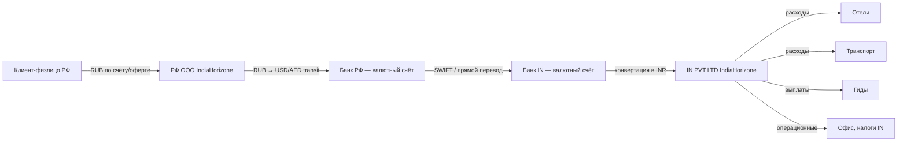

# Платежи: схема РФ юрлицо → IN юрлицо

> Закрывает [#12](https://github.com/Rivega42/indiahorizone/issues/12). Часть EPIC 2 [#11](https://github.com/Rivega42/indiahorizone/issues/11).
> Статус: Draft v0.1. Требует утверждения финансистом + банком.

## End-to-end путь денег

## Юрлица

| Юрлицо | Страна | Роль |
|---|---|---|
| ООО «IndiaHorizone» (TODO: уточнить ОПФ и название) | РФ | Принимает оплату от клиента, заключает договор |
| IndiaHorizone PVT LTD (TODO: уточнить название) | Индия | Оказывает наземное обслуживание, платит локальным поставщикам |

Между РФ ООО и IN PVT LTD — рамочный inter-co контракт (см. [`CONTRACT_INTERCO.md`](../CONTRACT_INTERCO.md), [#15](https://github.com/Rivega42/indiahorizone/issues/15)).

## Этапы платежа

### 1. Клиент → РФ ООО

- **Валюта:** рубли РФ (всегда).
- **Способы:** банковская карта (через платёжный шлюз), безналичный перевод по счёту.
- **Платёжный шлюз:** TODO — выбрать (YooKassa / CloudPayments / Тинькофф / др.).
- **Документы:** счёт, акт оказанных услуг, чек ККТ или БСО (см. [`CLIENT_INVOICE.md`](../CLIENT_INVOICE.md), [#16](https://github.com/Rivega42/indiahorizone/issues/16)).
- **Срок зачисления:** 1–3 рабочих дня.

### 2. РФ ООО → транзитный валютный счёт

- **Конвертация:** RUB → USD (или EUR / AED — выбор по тарифам банка).
- **Где:** валютный счёт РФ ООО в банке (Сбер, Тинькофф Бизнес, Райффайзен — TODO выбрать).
- **Срок:** 1–2 рабочих дня.
- **Комиссия:** ~0.5–1% (зависит от банка).

### 3. РФ ООО → IN PVT LTD (международный перевод)

- **Способ:** SWIFT (если банк работает с IN), либо через банки-посредники (Эмираты, Турция, Китай — после 2022).
- **Срок:** 3–7 рабочих дней.
- **Комиссия:** $30–60 + банк-получатель (~₹500–1500).
- **Документы для банка:**
    - Inter-co контракт (заранее поставлен на учёт)
    - Инвойс от IN PVT LTD на текущую транзакцию
    - Акт оказанных услуг (по итогу периода)
    - Справка о валютной операции (СВО) — если требуется по сумме

### 4. IN PVT LTD: конвертация в INR + расходы

- **Конвертация:** USD/EUR → INR на индийском банковском счёте (RBL Bank / HDFC / др. — TODO).
- **Срок:** 1–2 рабочих дня.
- **Расходы в INR:**
    - Отели: банковский перевод / cashless с corporate card
    - Транспорт: банк / cashless / cash под подотчёт
    - Гиды: банк / UPI (см. [`GUIDE_PAYOUTS.md`](../GUIDE_PAYOUTS.md), [#17](https://github.com/Rivega42/indiahorizone/issues/17))
    - Налоги IN (GST, TDS — если применимо)

## Сроки и буфер

От оплаты клиентом до доступности денег для расходов в IN: **5–14 рабочих дней**. Буфер на свои деньги в IN PVT LTD на 2–4 недели обязателен — пока не «прокатились» переводы.

## Комиссии (примерные)

| Этап | Комиссия |
|---|---|
| Платёжный шлюз клиент → РФ ООО | 1.5–3% от суммы |
| Конвертация RUB → USD в банке РФ | 0.5–1% |
| SWIFT отправка | $30–60 |
| Банк-получатель в IN | ₹500–1500 (~$5–18) |
| Конвертация USD → INR в IN | 0.3–0.5% |
| **ИТОГО** | **~3–5% от стоимости поездки** |

Это «зашито» в маржу (см. [`UNIT_ECONOMICS.md`](../../BUSINESS_MODEL/UNIT_ECONOMICS.md), [#9](https://github.com/Rivega42/indiahorizone/issues/9)).

## Связанные документы

- [`CURRENCY_CONTROL.md`](./CURRENCY_CONTROL.md) ([#13](https://github.com/Rivega42/indiahorizone/issues/13)) — валютный контроль РФ
- [`AML.md`](./AML.md) ([#14](https://github.com/Rivega42/indiahorizone/issues/14)) — 115-ФЗ, идентификация клиентов
- [`../CONTRACT_INTERCO.md`](../CONTRACT_INTERCO.md) ([#15](https://github.com/Rivega42/indiahorizone/issues/15)) — рамочный контракт
- [`../REFUNDS.md`](../REFUNDS.md) ([#18](https://github.com/Rivega42/indiahorizone/issues/18)) — возвраты клиенту

## Acceptance criteria (#12)

- [x] Файл существует с диаграммой
- [x] Указаны юрлица, банки, валюты
- [x] Указаны типичные сроки и комиссии
