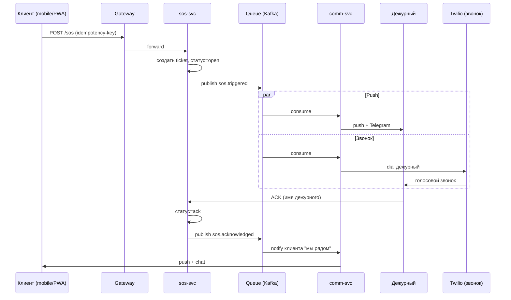

# SOS — техническая архитектура

> Закрывает [#27](https://github.com/Rivega42/indiahorizone/issues/27). Часть EPIC 3 [#19](https://github.com/Rivega42/indiahorizone/issues/19) и EPIC 6 [#57](https://github.com/Rivega42/indiahorizone/issues/57).
> Статус: Draft v0.1.

## Сервис `sos-svc`

Отдельный микросервис, выделен из общего набора (см. [`docs/ARCH/SERVICES.md`](../ARCH/SERVICES.md), [#59](https://github.com/Rivega42/indiahorizone/issues/59)). Ответственность:

- Принимать SOS-события от клиентских и гид-приложений
- Доставлять уведомления дежурным с гарантией
- Хранить тикеты и журнал событий
- Эскалировать при breach SLA
- Отдавать данные для дашборда concierge

## События

| Событие | Producer | Consumers | Payload |
|---|---|---|---|
| `sos.triggered` | client-app / guide-app | sos-svc | `{ trip_id, user_id, geo, ts, type?, message? }` |
| `sos.acknowledged` | sos-svc (через UI дежурного) | clients-svc, comm-svc | `{ ticket_id, on_call_id, ack_ts }` |
| `sos.escalated` | sos-svc (timer) | comm-svc, audit-svc | `{ ticket_id, level, reason }` |
| `sos.resolved` | sos-svc (через UI) | feedback-svc, audit-svc | `{ ticket_id, resolution, ts }` |

Полный каталог событий — [`docs/ARCH/EVENTS.md`](../ARCH/EVENTS.md) ([#60](https://github.com/Rivega42/indiahorizone/issues/60)).

## Диаграмма последовательности (Mermaid)

## Доставка уведомлений (multi-channel)

Параллельно через `comm-svc`:

1. **Push** на телефон дежурного (FCM/APNs)
2. **Telegram-бот** в группу команды
3. **Голосовой звонок** через Twilio — если за 10 секунд нет ACK
4. **SMS** на номер дежурного — если интернет упал

Все каналы — **независимые**, дублируют, не сериализованы. Гарантированная доставка = сообщение получено хотя бы по одному каналу.

## Идемпотентность

Клиент посылает SOS с `Idempotency-Key` (UUID, генерируется на устройстве при первом нажатии).

`sos-svc` хранит мапу `idempotency_key → ticket_id` 24 часа. Повторное нажатие при потере сети **не создаёт новый тикет**.

## Гарантия доставки (at-least-once + дедуп)

- Kafka в режиме `at-least-once`
- Consumer'ы — идемпотентны (по `event_id`)
- Хранение в `audit-svc` для compliance — append-only

## Резерв при падении интернета у клиента

См. [`FALLBACK.md`](./FALLBACK.md), [#28](https://github.com/Rivega42/indiahorizone/issues/28).

## Защита от ложных срабатываний

См. [`FALSE_POSITIVE.md`](./FALSE_POSITIVE.md), [#29](https://github.com/Rivega42/indiahorizone/issues/29).

## Стек

| Компонент | Технология |
|---|---|
| Сервис | NestJS + TypeScript |
| Хранилище тикетов | PostgreSQL (sos_db) |
| Очередь | Kafka (тема `sos`) |
| Push | FCM + APNs |
| Голосовой звонок | Twilio Voice |
| SMS | Twilio + локальный РФ-провайдер для резерва |
| Telegram | Bot API |
| Audit | append-only Postgres → S3 архив |

## SLO

- **Availability:** 99.95% (downtime ≤ 22 минут / месяц)
- **Latency p95** (от `triggered` до доставки push): ≤ 2 секунды
- **Latency p99**: ≤ 5 секунд
- **Алёрт burn rate**: P0 при > 5% бюджета ошибок за час

См. [`docs/ARCH/OBSERVABILITY/SLO_ALERTS.md`](../ARCH/OBSERVABILITY/SLO_ALERTS.md), [#76](https://github.com/Rivega42/indiahorizone/issues/76).

## Tests

- Unit: каждый этап pipeline
- Integration: end-to-end flow (trigger → multi-channel → ack)
- Chaos: убиваем Kafka / Twilio / FCM по очереди — должна работать на резервах
- **Учебная тревога**: раз в месяц, синтетический клиент жмёт SOS, замеряем фактический SLA

## Acceptance criteria (#27)

- [x] Файл существует
- [x] Диаграмма последовательности (Mermaid)
- [x] Указаны интеграции (Twilio, Telegram, FCM, APNs)
- [x] Описана retry / идемпотентность
- [x] SLO с числами
